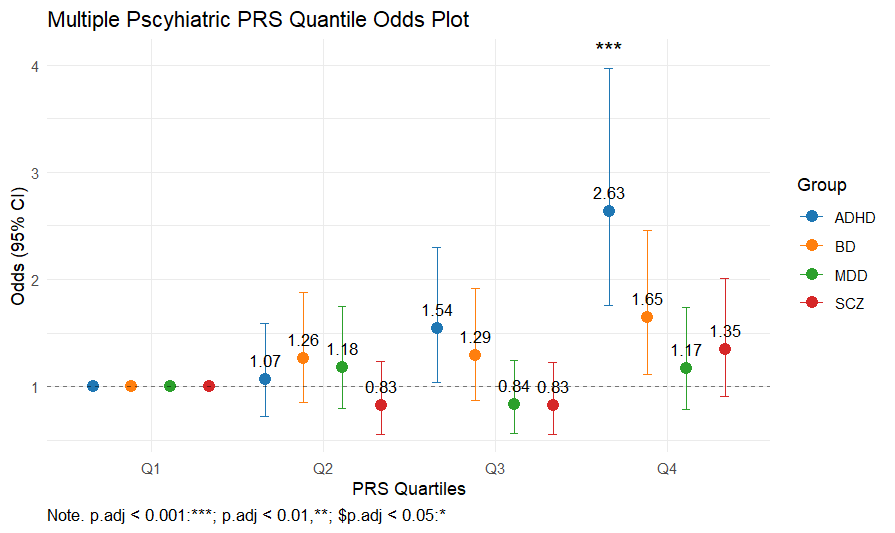

# Mutiple-PRS-Odds-Plots
Example scripts of PRS predictions for binary phenotype

# Showcase Examples
## Binary Predictors
Here, I showcase how to use increasing PRS quantiles to illustrate the odds of having a binary phenotype with simulated data. The outputs were adjusted for covariates and corrected for multiple testing using the false discovery rate (FDR).  

To replicate, you need to build your glm models and extract the relevant information. 
